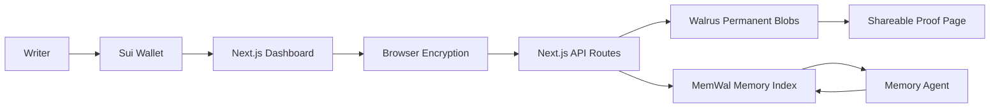
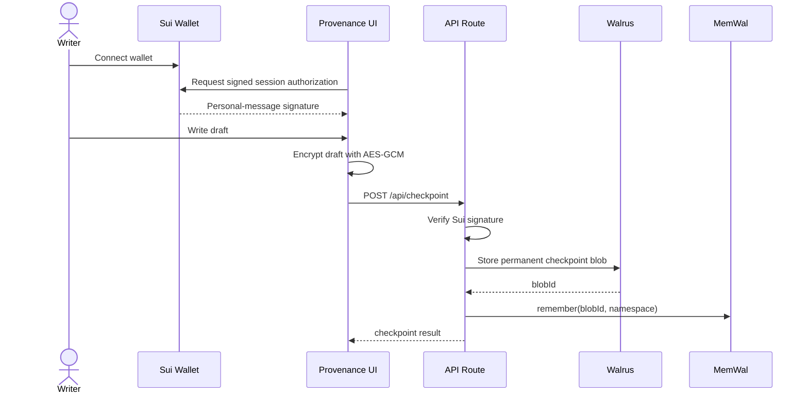
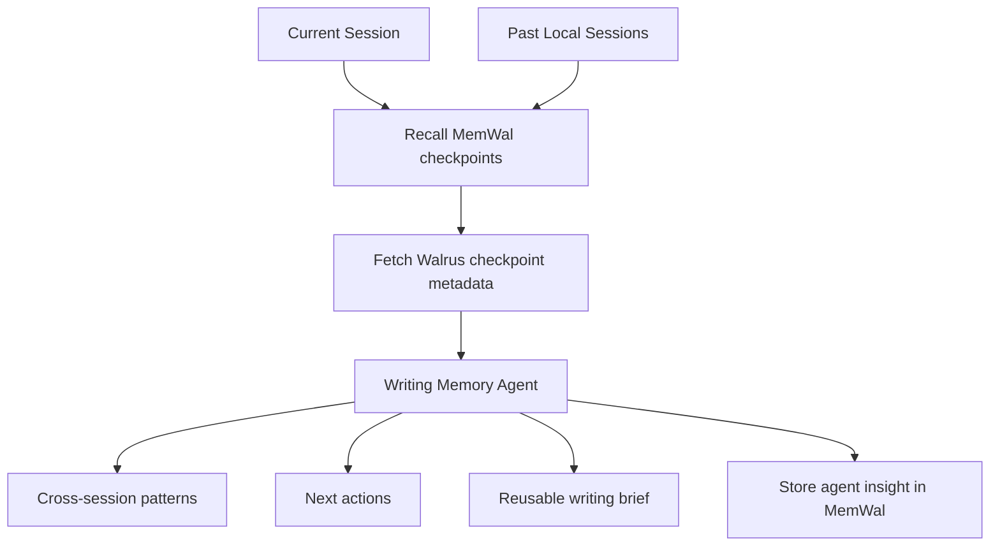

# Provenance

**Your writing, cryptographically proven.**

Provenance is a private, verifiable memory layer for long-running writing agents. It encrypts writing checkpoints in the browser, stores durable artifacts on Walrus, indexes session memory in MemWal, ties authorship to a Sui wallet, and publishes shareable proof pages that anyone can independently verify.

Built for the **Sui Overflow 2026 Walrus Track**.

## Clear Pitch

AI writing tools are useful, but they usually lose the process. Provenance makes the process portable and verifiable. A writer connects a Sui wallet, writes normally, and Provenance creates encrypted checkpoints over time. Those checkpoints become permanent Walrus blobs, their chain is remembered through MemWal, and a memory agent can recover context across sessions, summarize progress, suggest next actions, and generate a reusable writing brief.

For judges, the product demonstrates the exact Walrus Track thesis: agents become more useful when memory is durable, portable, and verifiable instead of trapped inside one app session.

## Why It Can Compete

| Judging Area | Provenance Answer |
| --- | --- |
| Product and UX | Polished wallet-gated landing page, responsive dashboard, editor, proof modal, session history, proofs, and agent panel. |
| Real-world application | Solves authorship, draft provenance, AI-era transparency, long-running writing context, and shareable proof of work. |
| Technical implementation | Sui wallet identity, signed route authorization, Walrus permanent blob storage, MemWal memory recall, encrypted checkpoints, proof publishing, and a Seal access-control Move package. |
| Presentation and vision | Clear path from hackathon demo to private creative memory infrastructure for writers, researchers, teams, and agent workflows. |

## Core Features

- Sui wallet identity through the current Mysten dApp Kit packages.
- Sui personal-message signatures for server-side authorship authorization.
- Browser AES-GCM encryption before checkpoint upload, so public Walrus blobs do not contain plaintext drafts.
- Walrus Testnet checkpoint, proof, and session-manifest publishing.
- MemWal checkpoint indexing under `provenance:{sessionId}` namespaces.
- Cross-session writing memory agent with themes, style notes, next actions, and reusable briefs.
- Shareable proof pages that fetch and verify checkpoint blobs through a public Walrus aggregator.
- Sui Move Seal policy package under `move/provenance_seal`.

## Architecture



## Checkpoint Flow



## Agentic Memory Flow



## Seal Privacy Path

The project includes the on-chain access-control policy needed by Seal:

- Move package: `move/provenance_seal`
- Module: `provenance_seal::provenance_private`
- Approval function: `seal_approve(id: vector<u8>, key: &CheckpointKey)`
- Policy: only the creator-owned `CheckpointKey` with the matching `creator + session_id + nonce` can approve key access.

Current working mode is browser AES-GCM encryption. Full Seal threshold mode requires deployment of the Move package and public Seal key-server configuration:

```env
NEXT_PUBLIC_SEAL_ENABLED=true
NEXT_PUBLIC_SEAL_PACKAGE_ID=0x_first_version_package_id
NEXT_PUBLIC_SEAL_MODULE=provenance_private
NEXT_PUBLIC_SEAL_THRESHOLD=2
NEXT_PUBLIC_SEAL_KEY_SERVERS=[{"objectId":"0x_key_server_1","weight":1,"aggregatorUrl":"https://..."},{"objectId":"0x_key_server_2","weight":1,"aggregatorUrl":"https://..."}]
```

The app records Seal readiness metadata with each encrypted payload. Until those values are configured after deployment, it safely falls back to wallet-session AES-GCM encryption.

## Stack

- Next.js 16, React 18, TypeScript, Tailwind CSS
- `@mysten/dapp-kit-react`, `@mysten/dapp-kit-core`, `@mysten/sui`
- `@mysten/walrus`
- `@mysten-incubation/memwal`
- `@mysten/seal`

## Environment

Create `.env.local` from `.env.example`.

```env
MEMWAL_KEY=your_delegate_private_key_hex
MEMWAL_ACCOUNT_ID=0x_your_memwal_account_id
MEMWAL_SERVER_URL=https://relayer.memory.walrus.xyz

WALRUS_PUBLISHER=https://publisher.walrus-testnet.walrus.space
WALRUS_AGGREGATOR=https://aggregator.walrus-testnet.walrus.space

NEXT_PUBLIC_WALRUS_AGGREGATOR=https://aggregator.walrus-testnet.walrus.space
NEXT_PUBLIC_APP_NAME=Provenance
NEXT_PUBLIC_DEMO_MODE=true
NEXT_PUBLIC_SITE_URL=http://localhost:3000

OPENAI_API_KEY=your_openai_api_key
```

Never commit `.env.local`. Server secrets such as `MEMWAL_KEY` and `OPENAI_API_KEY` must stay server-side.

## Run Locally

```bash
npm install
npm run dev
```

Open [http://localhost:3000](http://localhost:3000).

## Useful Commands

```bash
npm run type-check
npm run build
npm audit --omit=dev
npm run seal:build
```

## API Surface

| Route | Purpose |
| --- | --- |
| `POST /api/checkpoint` | Verify wallet signature, build checkpoint JSON, store to Walrus, remember in MemWal. |
| `GET /api/recall?sessionId=...` | Recall checkpoint memory chain for a session. |
| `POST /api/proof` | Recall checkpoints, fetch Walrus blobs, generate proof HTML, publish proof to Walrus. |
| `POST /api/session-share` | Publish a portable session manifest to Walrus. |
| `POST /api/agent/analyze` | Recall memory, analyze session history, compare past sessions, store agent insight. |

## Submission Demo Script

1. Open the landing page and explain the problem: AI writing agents lose durable memory and cannot prove the writing process.
2. Connect a Sui wallet and show redirect into the dashboard.
3. Write a short draft and click **Seal Now** or wait for the demo checkpoint cadence.
4. Open the checkpoint log and show the Walrus blob ID.
5. Run the AI Writing Agent and show recovered themes, cross-session memory, next actions, and reusable brief.
6. Generate a proof page and open the Walrus proof URL.
7. Show that the proof page verifies checkpoints through public Walrus blob references.
8. Disconnect the wallet and show redirect back to the landing page.

## Verification Status

- `npm run type-check` passes.
- `npm run build` passes.
- `npm audit --omit=dev` reports zero production vulnerabilities.
- Real live checkpoint, MemWal recall, session share, and proof publishing depend on valid MemWal delegate credentials and Walrus Testnet availability.
- Full Seal threshold access control requires deploying `move/provenance_seal` and setting the public Seal env vars.

## License

MIT. Developed for Sui Overflow 2026.
