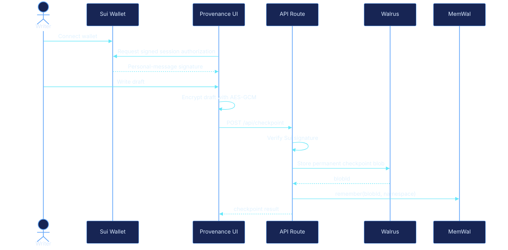
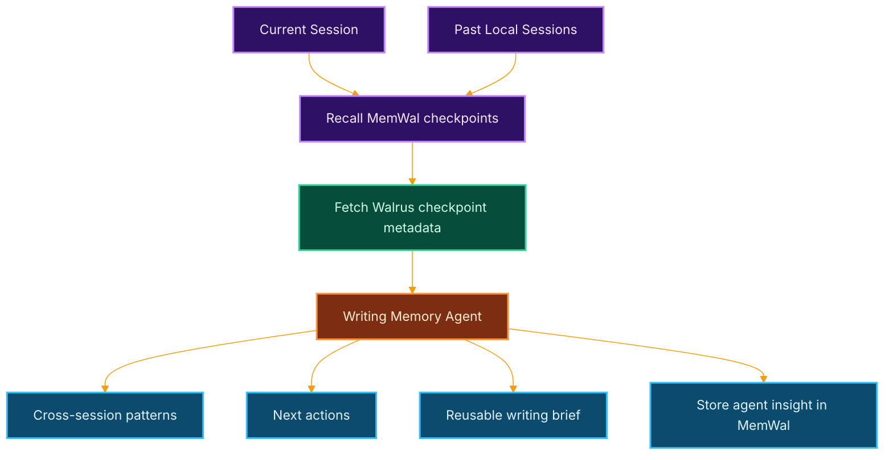

# Provenance

**Your writing, cryptographically proven.**

Provenance is a private, verifiable memory layer for long-running writing agents. It encrypts writing checkpoints in the browser, stores durable artifacts on [Walrus](https://docs.wal.app/), indexes session memory in [MemWal](https://docs.memwal.ai/), ties authorship to a [Sui](https://sui.io/) wallet, and publishes shareable proof pages that anyone can independently verify. Its [Seal](https://seal-docs.wal.app/) access-control policy is deployed on [Sui Testnet](https://docs.sui.io/concepts/sui-architecture/sui-environments) for the next privacy hardening step.

Built for the **[Sui Overflow 2026](https://sui.io/overflow) Walrus Track**.

## Clear Pitch

AI writing tools are useful, but they usually lose the process. Provenance makes the process portable and verifiable. A writer connects a Sui wallet, writes normally, and Provenance creates encrypted checkpoints over time. Those checkpoints become permanent Walrus blobs, their chain is remembered through MemWal, and a memory agent can recover context across sessions, summarize progress, suggest next actions, and generate a reusable writing brief.

For judges, the product demonstrates the exact Walrus Track thesis: agents become more useful when memory is durable, portable, and verifiable instead of trapped inside one app session.

## Why It Can Compete

| Judging Area | Provenance Answer |
| --- | --- |
| Product and UX | Polished wallet-gated landing page, responsive dashboard, editor, proof modal, session history, proofs, and agent panel. |
| Real-world application | Solves authorship, draft provenance, AI-era transparency, long-running writing context, and shareable proof of work. |
| Technical implementation | [Sui](https://sui.io/) wallet identity, signed route authorization, [Walrus](https://docs.wal.app/) permanent blob storage, [MemWal](https://docs.memwal.ai/) memory recall, encrypted checkpoints, proof publishing, and a [Seal](https://seal-docs.wal.app/) access-control Move package. |
| Presentation and vision | Clear path from hackathon demo to private creative memory infrastructure for writers, researchers, teams, and agent workflows. |

## Core Features

- [Sui](https://sui.io/) wallet identity through the current [Mysten dApp Kit](https://sdk.mystenlabs.com/dapp-kit) packages.
- [Sui personal-message signatures](https://sdk.mystenlabs.com/typescript/cryptography/keypairs#signing-and-verifying-messages) for server-side authorship authorization.
- Browser AES-GCM encryption before checkpoint upload, so public Walrus blobs do not contain plaintext drafts.
- [Walrus Testnet](https://docs.wal.app/docs/system-overview/public-aggregators-and-publishers) checkpoint, proof, and session-manifest publishing.
- [MemWal](https://docs.memwal.ai/) checkpoint indexing under `provenance:{sessionId}` namespaces.
- Cross-session writing memory agent with themes, style notes, next actions, and reusable briefs.
- Shareable proof pages that fetch and verify checkpoint blobs through a public Walrus aggregator.
- [Sui Move](https://docs.sui.io/concepts/sui-move-concepts) [Seal](https://seal-docs.wal.app/) policy package deployed on Testnet under `move/provenance_seal`.

## Architecture

```mermaid
%%{init: {"theme": "base", "themeVariables": {"background": "#0b1020", "primaryColor": "#102a43", "primaryTextColor": "#e0f2fe", "primaryBorderColor": "#38bdf8", "secondaryColor": "#193549", "tertiaryColor": "#14213d", "lineColor": "#8b5cf6", "fontFamily": "Inter, Arial", "fontSize": "15px"}}}%%
flowchart LR
  Writer["Writer"] --> Wallet["Sui Wallet"]
  Wallet --> UI["Next.js Dashboard"]
  UI --> Encrypt["Browser Encryption"]
  Encrypt --> API["Next.js API Routes"]
  API --> Walrus["Walrus Permanent Blobs"]
  API --> MemWal["MemWal Memory Index"]
  MemWal --> Agent["Memory Agent"]
  Walrus --> Proof["Shareable Proof Page"]
  Agent --> MemWal

  classDef user fill:#172554,stroke:#60a5fa,color:#dbeafe,stroke-width:2px
  classDef app fill:#312e81,stroke:#a78bfa,color:#ede9fe,stroke-width:2px
  classDef storage fill:#064e3b,stroke:#34d399,color:#d1fae5,stroke-width:2px
  classDef agent fill:#7c2d12,stroke:#fb923c,color:#ffedd5,stroke-width:2px
  classDef proof fill:#581c87,stroke:#d8b4fe,color:#f3e8ff,stroke-width:2px

  class Writer,Wallet user
  class UI,Encrypt,API app
  class Walrus,MemWal storage
  class Agent agent
  class Proof proof
```



## Checkpoint Flow



## Agentic Memory Flow



## Seal Privacy Path

The project includes the on-chain access-control policy needed by Seal:

- Move package: [`move/provenance_seal`](move/provenance_seal)
- Module: `provenance_seal::provenance_private`
- Testnet package ID: [`0x490d372b955a11c6e0bf0b1af43c5b66c3b3b190f68268907fdf4f463987b49a`](https://suiscan.xyz/testnet/object/0x490d372b955a11c6e0bf0b1af43c5b66c3b3b190f68268907fdf4f463987b49a)
- Publish transaction: [`7wTXSJseRiRWWkPf57kmWQCDA75T6gznwjzbUASmR6E2`](https://suiscan.xyz/testnet/tx/7wTXSJseRiRWWkPf57kmWQCDA75T6gznwjzbUASmR6E2)
- Approval function: `seal_approve(id: vector<u8>, key: &CheckpointKey)`
- Policy: only the creator-owned `CheckpointKey` with the matching `creator + session_id + nonce` can approve key access.

Current working mode is browser AES-GCM encryption with deployed Seal policy metadata. The deployed package and [verified Testnet committee key server](https://seal-docs.wal.app/Pricing#verified-decentralized-key-servers) configuration are ready for full Seal threshold encryption:

```env
NEXT_PUBLIC_SEAL_ENABLED=true
NEXT_PUBLIC_SEAL_PACKAGE_ID=0x490d372b955a11c6e0bf0b1af43c5b66c3b3b190f68268907fdf4f463987b49a
NEXT_PUBLIC_SEAL_MODULE=provenance_private
NEXT_PUBLIC_SEAL_THRESHOLD=3
NEXT_PUBLIC_SEAL_KEY_SERVERS=[{"objectId":"0xb012378c9f3799fb5b1a7083da74a4069e3c3f1c93de0b27212a5799ce1e1e98","weight":5,"aggregatorUrl":"https://seal-aggregator-testnet.mystenlabs.com"}]
```

The app records Seal readiness metadata with each encrypted payload. If the Seal environment is absent, it safely falls back to wallet-session AES-GCM encryption. The on-chain package is intentionally small and auditable: it creates creator-owned checkpoint key objects and exposes `seal_approve` for Seal key-server policy evaluation.

## Stack

- [Next.js 16](https://nextjs.org/), [React 18](https://react.dev/), [TypeScript](https://www.typescriptlang.org/), [Tailwind CSS](https://tailwindcss.com/)
- [`@mysten/dapp-kit-react`](https://sdk.mystenlabs.com/dapp-kit), [`@mysten/dapp-kit-core`](https://sdk.mystenlabs.com/dapp-kit), [`@mysten/sui`](https://sdk.mystenlabs.com/typescript)
- [`@mysten/walrus`](https://sdk.mystenlabs.com/walrus)
- [`@mysten-incubation/memwal`](https://github.com/MystenLabs/MemWal)
- [`@mysten/seal`](https://seal-docs.wal.app/)

## Environment

Create `.env.local` from `.env.example`.

```env
MEMWAL_KEY=your_delegate_private_key_hex
MEMWAL_ACCOUNT_ID=0x_your_memwal_account_id
MEMWAL_SERVER_URL=https://relayer.memory.walrus.xyz

WALRUS_PUBLISHER=https://publisher.walrus-testnet.walrus.space
WALRUS_AGGREGATOR=https://aggregator.walrus-testnet.walrus.space

NEXT_PUBLIC_WALRUS_AGGREGATOR=https://aggregator.walrus-testnet.walrus.space
NEXT_PUBLIC_APP_NAME=Provenance
NEXT_PUBLIC_DEMO_MODE=true
NEXT_PUBLIC_SITE_URL=http://localhost:3000

OPENAI_API_KEY=your_openai_api_key
```

Never commit `.env.local`. Server secrets such as `MEMWAL_KEY` and `OPENAI_API_KEY` must stay server-side.

## Run Locally

```bash
npm install
npm run dev
```

Open [http://localhost:3000](http://localhost:3000).

## Useful Commands

```bash
npm run type-check
npm run build
npm audit --omit=dev
npm run seal:build
```

## API Surface

| Route | Purpose |
| --- | --- |
| `POST /api/checkpoint` | Verify wallet signature, build checkpoint JSON, store to Walrus, remember in MemWal. |
| `GET /api/recall?sessionId=...` | Recall checkpoint memory chain for a session. |
| `POST /api/proof` | Recall checkpoints, fetch Walrus blobs, generate proof HTML, publish proof to Walrus. |
| `POST /api/session-share` | Publish a portable session manifest to Walrus. |
| `POST /api/agent/analyze` | Recall memory, analyze session history, compare past sessions, store agent insight. |

## Submission Demo Script

Target length: 4 to 5 minutes.

1. **Problem, 20 seconds:** AI writing agents lose long-term context and cannot prove how a piece of writing evolved.
2. **Solution, 25 seconds:** Provenance turns a writing session into encrypted Walrus artifacts, MemWal memory, Sui wallet authorship, and a public proof page.
3. **Landing page, 25 seconds:** Show the homepage, tagline, Walrus/MemWal/Sui positioning, and click the wallet connect CTA.
4. **Wallet identity, 30 seconds:** Connect a Sui wallet and show the redirect into the dashboard.
5. **Checkpoint creation, 45 seconds:** Type a short draft, trigger a checkpoint, and show the checkpoint log with word count and Walrus blob ID.
6. **Memory agent, 55 seconds:** Run the AI Writing Agent and show themes, style notes, cross-session memory, next actions, and reusable brief.
7. **Proof publishing, 45 seconds:** Generate a proof page, open the Walrus proof URL, and show the verification/integrity section.
8. **Technical proof, 35 seconds:** Briefly show the README architecture and the deployed Seal package ID on Sui Testnet.
9. **Close, 20 seconds:** Explain why this matters for the Walrus Track: portable memory, durable files, verifiable artifacts, and a product path beyond the hackathon.

## Verification Status

- `npm run type-check` passes.
- `npm run build` passes.
- `npm audit --omit=dev` reports zero production vulnerabilities.
- `npm run seal:build` passes.
- [`move/provenance_seal`](move/provenance_seal) is published on Sui Testnet at [`0x490d372b955a11c6e0bf0b1af43c5b66c3b3b190f68268907fdf4f463987b49a`](https://suiscan.xyz/testnet/object/0x490d372b955a11c6e0bf0b1af43c5b66c3b3b190f68268907fdf4f463987b49a).
- Real live checkpoint, MemWal recall, session share, and proof publishing depend on valid MemWal delegate credentials and Walrus Testnet availability.
- Seal threshold access-control package and public key-server config are deployed and documented; browser AES-GCM remains the current default encryption mode until full `@mysten/seal` encrypt/decrypt UX is enabled.

## License

MIT. Developed for Sui Overflow 2026.
