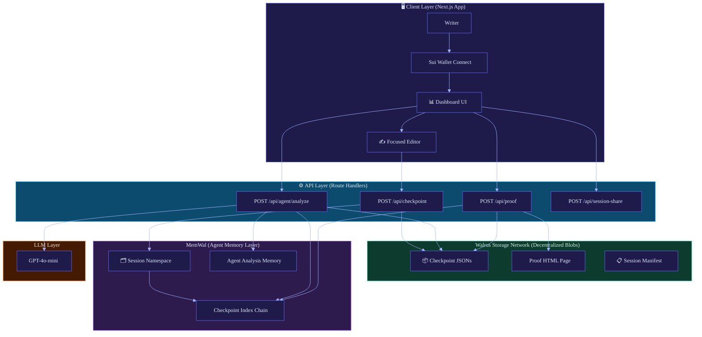
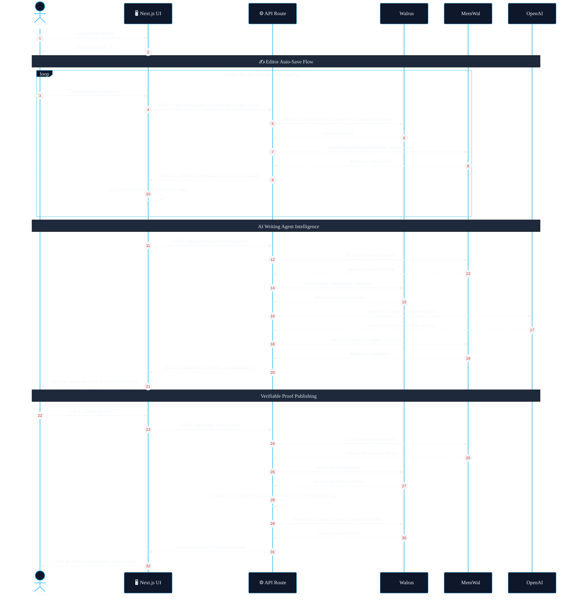

# 🔏 Provenance

<p align="center">
  
</p>

<p align="center">
  <strong>Your writing, cryptographically proven. 🖊️✨</strong><br/>
  <em>An Agentic Co-Writer Powered by Sui, Walrus, & MemWal</em>
</p>

<p align="center">
  <a href="https://sui.io"></a>
  <a href="https://walrus.xyz"></a>
  <a href="https://memwal.ai"></a>
  
  
</p>

<p align="center">
  <a href="#-what-is-provenance">Overview</a> •
  <a href="#-architecture">Architecture</a> •
  <a href="#-data-flow">Data Flow</a> •
  <a href="#-ai-agent-integration">AI Agent Flow</a> •
  <a href="#-quick-start">Quick Start</a> •
  <a href="#-api-reference">API Documentation</a> •
  <a href="#-verification">Verification</a>
</p>

---

## 🌟 What is Provenance?

**Provenance** is a full-stack Next.js application that provides writers, researchers, and creators with a **verifiable, tamper-proof audit trail** of their document's creation history. In an era dominated by AI-generated content, **the process is the proof**. Provenance records your creative journey in real-time, anchoring checkpoints to your Sui wallet, saving files on Walrus, and persisting state across sessions using MemWal.

Built for the **🏆 Sui Overflow 2026 — Walrus Track**, Provenance demonstrates how decentralized data and agentic memory systems can cooperate to create verifiable workflows.

### ✨ Key Features

| Feature | Technical Implementation |
|--------|--------------------------|
| 🔑 **Sui Wallet Identity** | User authentication anchored to Sui testnet addresses via `@mysten/dapp-kit-react` |
| 📝 **Focused Editor** | Distraction-free, responsive dark-mode text editor with real-time statistics |
| ⏱️ **Encrypted Auto-Seal Checkpoints** | Draft states are encrypted in-browser, then sealed as permanent content-addressed JSON blobs on Walrus |
| 🧠 **Verifiable Memory Chains** | Sequential history links stored in MemWal session namespaces (`provenance:{sessionId}`) |
| 🤖 **Cross-Session Memory Agent** | Background intelligence analyzing writing velocity, themes, style, cross-session patterns, next actions, and reusable briefs |
| 📄 **Shareable Proof Pages** | Self-contained, beautiful verification HTML pages served as raw `text/html` from Walrus |
| 🔍 **Independent Auditing** | Verify any proof page independently using only public Walrus aggregators and SHA-256 hashes |

---

## 🏗️ Architecture

The block diagram below showcases the interaction between the Client, API, Decentralized Storage (Walrus), Agent Memory (MemWal), and LLM layer.



---

## 🌊 Data Flow

This sequence diagram illustrates the lifecycle of a writing session, starting from wallet connection through to checkpoint sealing, LLM agent analysis, and proof publishing.



---

## 🤖 AI Agent Integration

Provenance fulfills the requirements of the Walrus Track by introducing a **Writing Intelligence Agent** powered by a persistent, verifiable memory stack:

1. **Memory Recovery:** When a session is loaded, the agent queries MemWal to reconstruct the history of writing milestones.
2. **Context Assembly:** It retrieves actual draft contents from the decentralized Walrus storage network using content-addressed blob IDs.
3. **LLM Reasoning:** Excerpts are passed to a customized model prompt designed to evaluate creative progress, style modifications, argument developments, and writing speed.
4. **Verifiable Storage:** The agent's output is recorded back to MemWal inside the session namespace, ensuring the agent's insights are portable and auditable.

---

## 🚀 Quick Start

### Prerequisites
- Node.js ≥ 18
- A Sui-compatible wallet browser extension (Sui Wallet, Slush, etc.)
- A [MemWal delegate account key](https://memwal.ai)

### 1. Clone & Install
```bash
git clone https://github.com/SumitRaikwar18/Provenance.git
cd Provenance
npm install
```

### 2. Configure Environment Variables
Create a `.env.local` file in the root directory:
```env
# MemWal Agent Memory (Server-Side Only)
MEMWAL_KEY=your_memwal_delegate_private_key_hex
MEMWAL_ACCOUNT_ID=0x_your_memwal_account_id
MEMWAL_SERVER_URL=https://relayer.memory.walrus.xyz

# Walrus API endpoints
WALRUS_PUBLISHER=https://publisher.walrus-testnet.walrus.space
WALRUS_AGGREGATOR=https://aggregator.walrus-testnet.walrus.space

# AI Agent Configuration
OPENAI_API_KEY=your_openai_api_key

# Public (Browser-Safe)
NEXT_PUBLIC_WALRUS_AGGREGATOR=https://aggregator.walrus-testnet.walrus.space
NEXT_PUBLIC_APP_NAME=Provenance
NEXT_PUBLIC_DEMO_MODE=true
NEXT_PUBLIC_SITE_URL=http://localhost:3000
```
> [!WARNING]
> Keep `.env.local` out of your git commits. The `MEMWAL_KEY` and `OPENAI_API_KEY` are sensitive keys and should never be exposed to the client.

### 3. Launch Development Server
```bash
npm run dev
```
Open [http://localhost:3000](http://localhost:3000) to view the application.

---

## 📡 API Reference

### `POST /api/checkpoint`
Seals a new writing checkpoint to Walrus and records its reference in MemWal.
```json
{
  "sessionId": "xY8zW2",
  "walletAddress": "0x7a23...b9c1",
  "content": "This is the updated draft text...",
  "checkpointIndex": 1
}
```
**Response:**
```json
{
  "success": true,
  "blobId": "M4hsZGQ1oCVZt-e3s...W7_4BUk",
  "timestamp": "2026-06-17T06:00:00.000Z",
  "checkpointIndex": 1,
  "wordCount": 7
}
```

### `POST /api/agent/analyze`
Triggers the AI agent to read Walrus files, compile the history, analyze progress, and store memory.
```json
{
  "sessionId": "xY8zW2",
  "walletAddress": "0x7a23...b9c1"
}
```
**Response:**
```json
{
  "success": true,
  "insight": {
    "themes": ["Cryptographic accountability", "Decentralized state systems"],
    "styleNotes": "The user writes with a formal, academic tone using active voice constructions.",
    "paceSummary": "Writing momentum is consistent, adding roughly 7 words per checkpoint.",
    "keyIdeas": ["Decentralization of memory structures", "Walrus as an auditing back-bone"],
    "agentSummary": "Your thesis is shaping up beautifully. The structural transition between checkpoints 1 and 2 shows strong reasoning.",
    "analyzedAt": "2026-06-17T06:01:00.000Z",
    "checkpointCount": 2
  }
}
```

---

## ✅ Verification & Auditing

Anyone can verify a generated proof page independently using raw tools.

1. Open the proof's public Walrus aggregator URL.
2. In the *Integrity Log*, copy any target `Blob ID` and the expected `SHA-256 Hash`.
3. Fetch the raw blob from the aggregator:
   ```bash
   curl https://aggregator.walrus-testnet.walrus.space/v1/blobs/<Blob-ID>
   ```
4. Verify the `content` field of the returned JSON. Compute its SHA-256 hash:
   ```bash
   echo -n "<Content-Text>" | shasum -a 256
   ```
5. Compare the output to the expected hash displayed on the proof page. If they match, the proof is authentic and un-tampered.

---

## 🏆 Hackathon Checklist Status

- [x] **State Persistence:** MemWal keeps track of all checkpoint links.
- [x] **File Portability:** Encrypted checkpoint files and proof HTML pages are saved on Walrus, readable anywhere.
- [x] **AI Workflow:** AI agent analyzes writing progress, compares local session history, creates reusable briefs, and saves thoughts to the delegate's memory.
- [x] **Sui Integration:** Current dApp Kit wallet connection and Sui Testnet identity in the UI.
- [x] **Signed Authorship:** Server-side Sui personal-message signature verification protects checkpoint, proof, share, and agent routes.
- [x] **Private Draft Mode:** Browser-side AES-GCM encryption keeps plaintext drafts out of public Walrus blobs; Seal threshold access control is the next production hardening layer.
- [x] **Aesthetic UI:** Complete responsiveness with customized dark mode.

---

## Verified Testnet Status

The following flow was exercised against real services on June 18, 2026:

- Walrus checkpoint upload returned a real blob ID.
- MemWal recalled the checkpoint from the session namespace.
- The writing agent analyzed the recalled Walrus content.
- A shareable session manifest was published to Walrus.
- A self-contained proof page was published to Walrus.
- `npm run type-check` and `npm run build` pass on Next.js 16.2.9.
- `npm audit --omit=dev` reports zero vulnerabilities.

Security and hackathon-readiness review status is summarized below.

### Current Audit Status

- **Working Testnet path:** wallet UI, signed session authorization, encrypted checkpoint upload, MemWal recall, agent analysis, session share, and proof publishing have been smoke-tested against real services.
- **Authorship:** server API routes verify a Sui personal-message signature before writing checkpoints, running agent analysis, publishing session manifests, or generating proofs.
- **Privacy:** checkpoint blobs store ciphertext and verification metadata, not plaintext draft text. Seal threshold encryption can replace the wallet-derived private mode after an access-control package is deployed.
- **Operations note:** write/costly API routes include basic rate limits and request-size caps; production deployment should add persistent edge quotas.
- **Dependency note:** Next.js is upgraded to `16.2.9` with a patched nested PostCSS override; production dependency audit is clean.

---

## 📜 License
MIT © 2026 [Sumit Raikwar](https://github.com/SumitRaikwar18) — Developed for Sui Overflow 2026.
