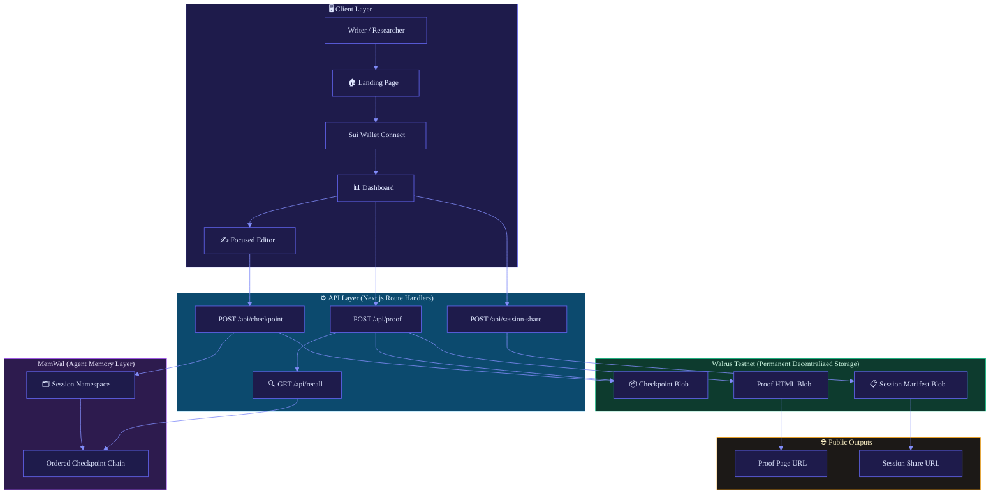
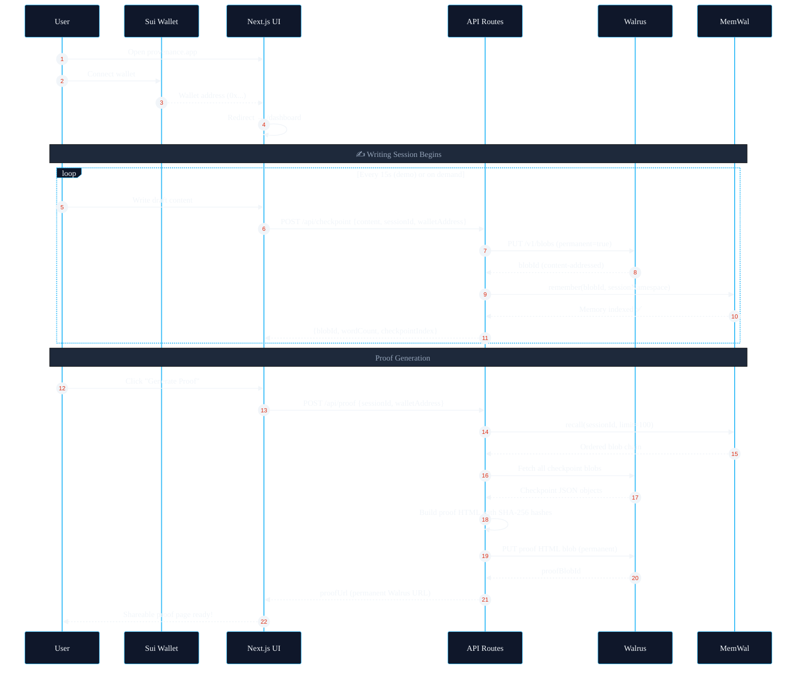
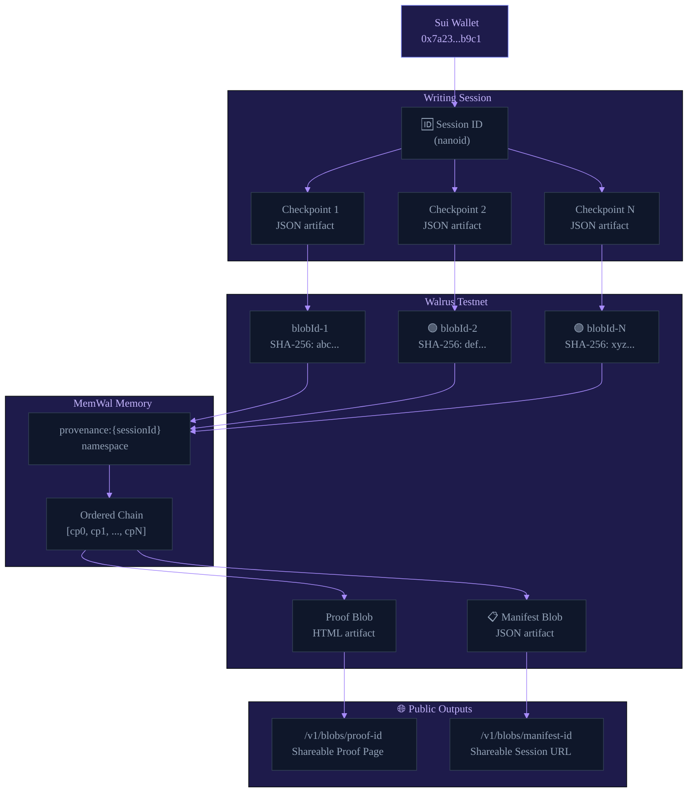
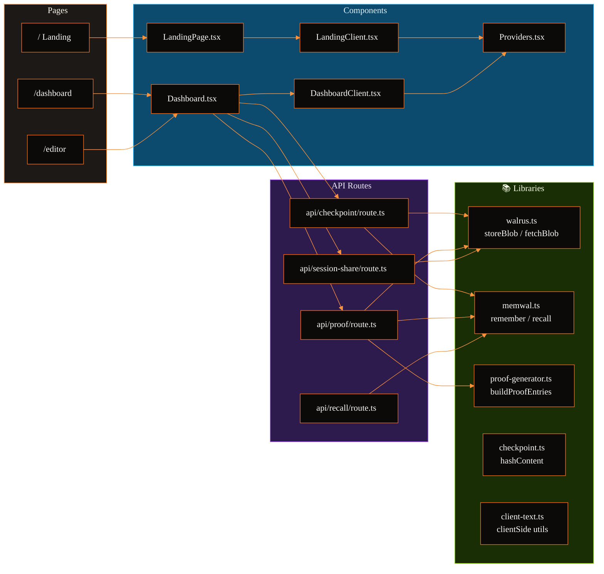

# 🔏 Provenance

<p align="center">
  
</p>

<p align="center">
  <strong>Your writing, cryptographically proven. 🖊️✨</strong><br/>
  <em>Built on Sui · Stored on Walrus · Remembered by MemWal</em>
</p>

<p align="center">
  <a href="https://sui.io"></a>
  <a href="https://walrus.xyz"></a>
  <a href="https://memwal.ai"></a>
  
  
  
</p>

<p align="center">
  <a href="#-demo-flow">Demo</a> •
  <a href="#-architecture">Architecture</a> •
  <a href="#-data-flow">Data Flow</a> •
  <a href="#-quick-start">Quick Start</a> •
  <a href="#-api-reference">API</a> •
  <a href="#-verification">Verification</a>
</p>

---

## 🌟 What is Provenance?

**Provenance** is a full-stack Next.js application that gives writers, researchers, students, and builders a **verifiable, tamper-proof record** of how a document was created — from the first word to the final sentence.

> In a world where AI can generate text effortlessly, **the process is the proof**. Provenance seals your creative journey into permanent, cryptographically verifiable checkpoints anchored to your Sui wallet.

Built for the **🏆 Sui Overflow 2026 — Walrus Track**: durable memory, persistent artifacts, and portable context for long-running workflows.

---

## ✨ Key Features

| Feature | Description |
|--------|-------------|
| 🔑 **Sui Wallet Auth** | Writer identity anchored to a real on-chain address |
| 📝 **Focused Editor** | Distraction-free writing environment with live word count |
| ⏱️ **Auto-Seal Checkpoints** | Every draft milestone sealed as a permanent Walrus blob |
| 🧠 **MemWal Memory Chain** | Ordered checkpoint chain stored in session namespaces |
| 📄 **Shareable Proof Pages** | Permanent HTML artifacts published directly to Walrus |
| 🔗 **Session Manifests** | Public session JSON published to Walrus for sharing |
| 🔍 **Independent Verification** | Anyone can verify proofs using Walrus blob URLs + SHA-256 |
| 🌐 **Full SEO** | Sitemap, robots, Open Graph, Twitter Cards |

---

## 🎬 Demo Flow

```
1. Connect Sui Wallet     →  Identity anchored to your wallet address
2. Open Writing Dashboard →  Live word count & checkpoint ticker
3. Write                  →  Focused, distraction-free editor
4. Auto-Seal              →  Checkpoint every 15s (demo) or on demand
5. Share Session          →  Publish manifest to Walrus → public URL
6. Generate Proof         →  MemWal recalls chain → permanent proof page
7. Disconnect             →  Clean session end, return to landing
```

---

## 🏗️ Architecture



---

## 🌊 Data Flow



---

## 📦 Artifact Model



---

## 🔄 Component Interaction



---

## 🔐 Security & Proof Integrity


---

## ⚡ Tech Stack

| Layer | Technology | Purpose |
|-------|-----------|---------|
| 🖥️ **Framework** | Next.js 14, React 18, TypeScript 5 | Full-stack app with API routes |
| 🎨 **Styling** | Tailwind CSS 3, custom CSS tokens | Responsive, dark-first design |
| 🔑 **Wallet** | `@mysten/dapp-kit-react`, `@mysten/dapp-kit-core` | Sui wallet integration |
| 🌊 **Storage** | Walrus HTTP API (`/v1/blobs`) | Permanent decentralized blob storage |
| 🧠 **Memory** | `@mysten-incubation/memwal` | Ordered agent memory for checkpoint chains |
| 🔐 **Hashing** | Web Crypto API (SHA-256) | Content-addressed proof integrity |
| 🆔 **IDs** | nanoid | Session and artifact identification |

---

## 🚀 Quick Start

### Prerequisites

- Node.js ≥ 18
- A Sui-compatible wallet (Sui Wallet, Slush, etc.)
- A [MemWal account](https://memwal.ai) with a delegate key

### 1. Clone & Install

```bash
git clone https://github.com/SumitRaikwar18/Provenance.git
cd Provenance
npm install
```

### 2. Configure Environment

```bash
cp .env.example .env.local
```

Edit `.env.local`:

```env
# MemWal Agent Memory (server-side only — never exposed to browser)
MEMWAL_KEY=your_delegate_private_key_hex
MEMWAL_ACCOUNT_ID=0x_your_memwal_account_id
MEMWAL_SERVER_URL=https://relayer.memory.walrus.xyz

# Walrus Storage Endpoints
WALRUS_PUBLISHER=https://publisher.walrus-testnet.walrus.space
WALRUS_AGGREGATOR=https://aggregator.walrus-testnet.walrus.space

# Public (safe to expose)
NEXT_PUBLIC_WALRUS_AGGREGATOR=https://aggregator.walrus-testnet.walrus.space
NEXT_PUBLIC_APP_NAME=Provenance
NEXT_PUBLIC_DEMO_MODE=true
NEXT_PUBLIC_SITE_URL=http://localhost:3000
```

> ⚠️ **Security**: `.env.local` is in `.gitignore` — **never** commit `MEMWAL_KEY` or any private credentials.

### 3. Run Development Server

```bash
npm run dev
```

Open [http://localhost:3000](http://localhost:3000) in your browser.

---

## 📡 API Reference

### `POST /api/checkpoint`

Stores a writing checkpoint as a permanent Walrus blob and indexes it in MemWal.

**Request:**
```json
{
  "sessionId": "abc123",
  "walletAddress": "0x7a23...b9c1",
  "content": "Draft text content...",
  "checkpointIndex": 0
}
```

**Response:**
```json
{
  "blobId": "M4hsZGQ1oC...W7_4BUk",
  "wordCount": 42,
  "checkpointIndex": 0,
  "contentHash": "sha256:abc..."
}
```

---

### `GET /api/recall?sessionId=abc123`

Recalls ordered checkpoint references from MemWal for a given session namespace.

**Response:**
```json
[
  { "sessionId": "abc123", "checkpointIndex": 0, "blobId": "...", "wordCount": 42 },
  { "sessionId": "abc123", "checkpointIndex": 1, "blobId": "...", "wordCount": 89 }
]
```

---

### `POST /api/proof`

Generates a permanent proof page: recalls MemWal chain → fetches checkpoint blobs → builds SHA-256 verified HTML → publishes to Walrus.

**Request:**
```json
{
  "sessionId": "abc123",
  "walletAddress": "0x7a23...b9c1"
}
```

**Response:**
```json
{
  "proofUrl": "https://aggregator.walrus-testnet.walrus.space/v1/blobs/...",
  "proofBlobId": "x7P4mS9kQ...aL2vN"
}
```

---

### `POST /api/session-share`

Publishes a shareable JSON manifest for a writing session.

**Response:**
```json
{
  "shareUrl": "https://aggregator.walrus-testnet.walrus.space/v1/blobs/...",
  "manifestBlobId": "oehkoh0352...dNAlXg"
}
```

---

## ✅ Verification

Run type checks and build:

```bash
npm run type-check
npm run build
```

**Independently verify a proof:**

1. Open the proof URL in your browser
2. Copy any `blobId` from the proof
3. Fetch: `GET https://aggregator.walrus-testnet.walrus.space/v1/blobs/{blobId}`
4. SHA-256 hash the `content` field
5. Compare to the displayed hash — they must match

**Testnet smoke test completed:**
- ✅ Checkpoint blob stored on Walrus Testnet
- ✅ MemWal recalled ordered checkpoint chain
- ✅ Proof page published as permanent Walrus blob
- ✅ Session manifest published as permanent Walrus blob

---

## 🗂️ Project Structure

```
provenance/
├── src/
│   ├── app/
│   │   ├── api/
│   │   │   ├── checkpoint/route.ts    # Store checkpoint → Walrus + MemWal
│   │   │   ├── proof/route.ts         # Generate proof page artifact
│   │   │   ├── recall/route.ts        # Recall MemWal checkpoint chain
│   │   │   └── session-share/route.ts # Publish session manifest
│   │   ├── dashboard/page.tsx         # Writing dashboard
│   │   ├── editor/page.tsx            # Focused writing editor
│   │   ├── layout.tsx                 # Root layout + full SEO metadata
│   │   ├── page.tsx                   # Landing page
│   │   ├── sitemap.ts                 # Dynamic XML sitemap
│   │   └── robots.ts                  # Robots.txt route
│   ├── components/
│   │   ├── Dashboard.tsx              # Main dashboard UI
│   │   ├── DashboardClient.tsx        # Client boundary wrapper
│   │   ├── LandingPage.tsx            # Landing page UI
│   │   ├── LandingClient.tsx          # Client boundary wrapper
│   │   └── Providers.tsx              # dApp Kit providers
│   ├── lib/
│   │   ├── walrus.ts                  # Walrus HTTP API (store/fetch/url)
│   │   ├── memwal.ts                  # MemWal client (remember/recall)
│   │   ├── proof-generator.ts         # Build + publish proof HTML
│   │   ├── checkpoint.ts              # SHA-256 content hashing
│   │   └── client-text.ts            # Client-side text utilities
│   └── types/
│       └── index.ts                   # TypeScript interfaces
├── .env.example                       # Environment variable template
├── .gitignore                         # Ignores .env.local, node_modules, etc.
├── next.config.js                     # Next.js configuration
├── package.json                       # Dependencies
├── tailwind.config.ts                 # Tailwind configuration
└── tsconfig.json                      # TypeScript configuration
```

---

## 🏆 Sui Overflow 2026 — Walrus Track

| Requirement | Provenance Implementation |
|-------------|--------------------------|
| 🧠 **Long-term memory** | MemWal stores checkpoint references in `provenance:{sessionId}` namespaces |
| 💾 **Persistent data** | Walrus stores checkpoint JSON, proof HTML, and session manifests (`permanent=true`) |
| ⏳ **Long-running workflows** | Sessions accumulate state over time and can resume across visits |
| 📄 **Artifact-driven workflows** | Proof pages and session manifests are durable, shareable Walrus artifacts |
| 🔗 **Portable context** | Walrus URLs open outside the app and are shareable with reviewers |
| 👨‍💻 **Developer adoption** | Reusable pattern for building Walrus + MemWal powered applications |

---

## 🔮 Future Roadmap

- [ ] **Seal Privacy** — Encrypted draft checkpoints using `@mysten/seal`
- [ ] **Team Sessions** — Multi-author writing with shared MemWal namespaces
- [ ] **Agent-Readable Memory** — Writing history queryable by AI agents via MemWal
- [ ] **Walrus Sites Deployment** — Deploy the app itself to Walrus Sites
- [ ] **Proof Comparison** — Side-by-side diff view between checkpoints
- [ ] **Export Formats** — PDF, EPUB export with embedded Walrus proof hashes

---

## 🔒 Security Checklist

- ✅ `.env.local` is in `.gitignore` — private keys never committed
- ✅ `MEMWAL_KEY` is server-side only — never sent to the browser
- ✅ `NEXT_PUBLIC_*` variables are intentionally public (URLs only)
- ✅ No API keys in source code
- ✅ Content hash verification prevents blob tampering
- ✅ Wallet address binding prevents session hijacking

---

## 📜 License

MIT © 2026 [Sumit Raikwar](https://github.com/SumitRaikwar18) — Built for Sui Overflow 2026

---

<p align="center">
  <strong>Built with 🌊 Walrus · 🧠 MemWal · ⚡ Sui</strong><br/>
  <em>Provenance — where creativity meets cryptographic proof.</em>
</p>
